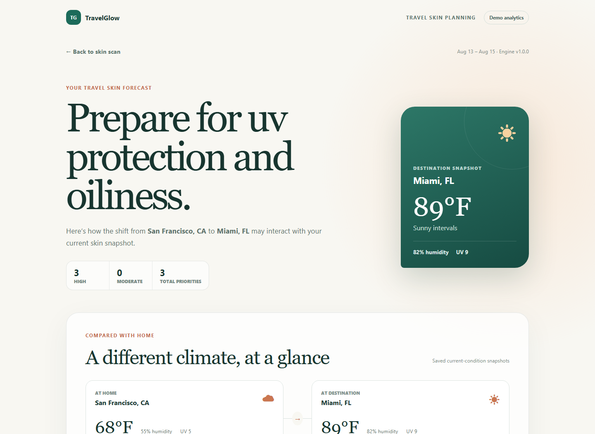
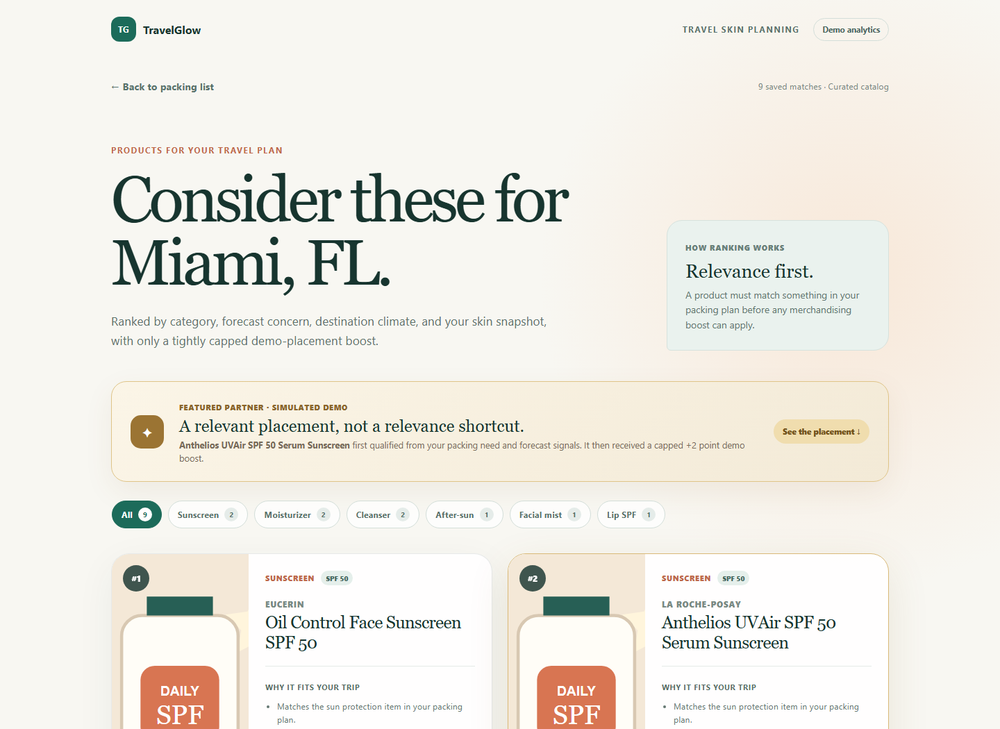
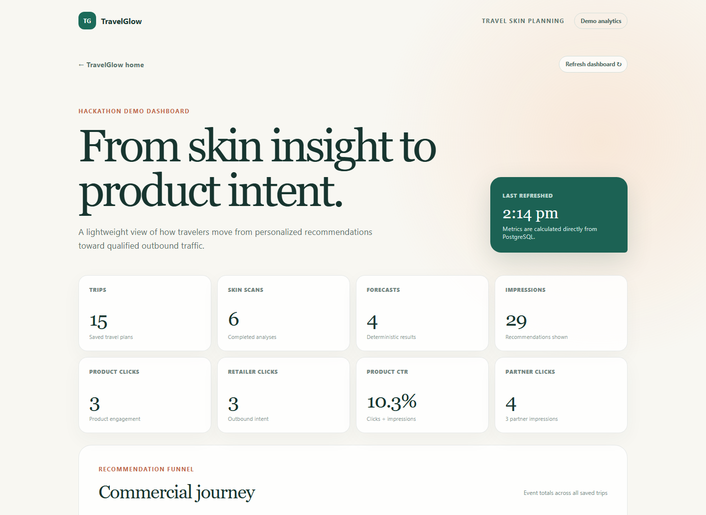
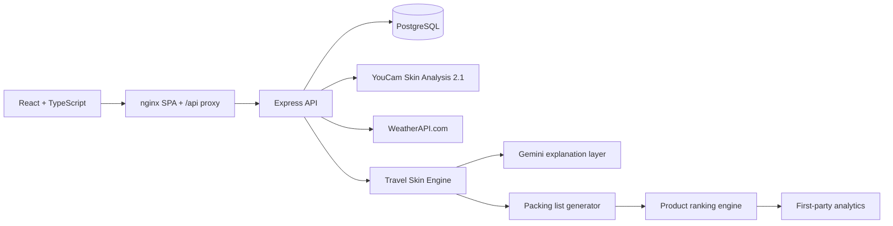

# TravelGlow

**A travel-aware skincare planner that turns a current cosmetic skin snapshot and destination conditions into a personalized Travel Skin Forecast.**

TravelGlow was built for the YouCam Devpost hackathon. It connects YouCam skin analysis, destination weather, a deterministic recommendation engine, and an optional Gemini explanation layer in one end-to-end planning journey.

## The idea

### Problem

Travel can expose skin to a very different mix of UV, temperature, and humidity. Generic packing lists do not account for either the traveler’s current skin condition or the environment they are entering.

### Solution

TravelGlow lets a traveler save a trip, capture home and destination conditions, analyze a clear selfie, and generate a cautious Travel Skin Forecast. That forecast drives an explainable packing list and relevance-ranked product suggestions.

### Key differentiator

The **Travel Skin Engine** owns every risk level and recommendation. It is deterministic, versioned, tested, and based only on normalized skin and environmental inputs. Gemini can make the result easier to understand, but it cannot invent concerns or change the engine’s advice.

## Product tour

### Travel Skin Forecast



### Personalized product matches



### First-party demo analytics



## Demo flow

1. Create a trip with a home city, destination, and travel dates.
2. Retrieve and save the environmental comparison.
3. Upload or take a clear front-facing JPEG/PNG selfie (shortest side at least 480 px, under 10 MB).
4. Generate the Travel Skin Forecast and review its explainable concerns.
5. Open the personalized packing list and curated product matches.
6. Visit `/admin/analytics` to see persisted recommendation and partner-demo activity.

Mock YouCam and weather modes are enabled by default, so this flow remains reliable without external credentials.

## Architecture



The browser talks to one origin. nginx serves the compiled React application and proxies `/api` to Express. The API runs idempotent SQL migrations at startup, persists the full journey in PostgreSQL, and keeps third-party credentials server-side.

## Technology stack

| Layer | Technology |
| --- | --- |
| Frontend | React 19, TypeScript, Vite, React Router |
| API | Node.js 22, Express 5, Zod |
| Database | PostgreSQL 17 with SQL migrations |
| Production edge | nginx, multi-stage Docker builds |
| External services | YouCam Skin Analysis API 2.1, WeatherAPI.com, Gemini REST API |
| Deployment | Docker Compose locally, Render Blueprint for production |

## External APIs

- **YouCam Skin Analysis API 2.1:** presigned image upload, asynchronous task creation/polling, then normalization into TravelGlow’s score model. Uploaded image bytes stay in memory and are not stored by TravelGlow.
- **WeatherAPI.com:** current-condition snapshots for home and destination. Snapshots are persisted so refreshes do not unexpectedly change an existing comparison.
- **Gemini:** structured, optional narrative generated only from the engine’s approved findings and tips. Forecast generation still succeeds if Gemini is unavailable.

## Travel Skin Engine

The versioned rules evaluate:

- destination UV exposure;
- humidity combined with current oiliness;
- dry-climate hydration pressure;
- heat combined with congestion/acne signals;
- cold and dry barrier-support needs.

Each forecast records the exact skin-analysis and environmental-comparison rows used. Replacing a scan or changing its upstream inputs invalidates dependent results. Packing lists and product recommendations are also deterministic and traceable to the saved forecast.

## Database design

Startup migrations create and evolve these main records:

- `trips`
- `environment_snapshots` and `environment_comparisons`
- `skin_analyses`
- `skin_forecasts`
- `packing_lists`
- `products`, `product_purchase_links`, and `product_recommendations`
- `analytics_events`
- `schema_migrations`

Foreign keys keep generated results tied to their source trip and allow stale dependent records to be removed safely. Applied migration filenames are recorded in `schema_migrations`, so startup migrations are automatic and idempotent.

## Local setup with Docker

Requirements: Docker Desktop with Docker Compose.

1. Copy `.env.example` to `.env` and add any live API credentials you want to use.
2. Build and start the complete application:

```bash
docker compose up --build
```

3. Open:

- App: http://localhost:8080
- API health: http://localhost:5000/api/health
- PostgreSQL: `localhost:5432`

### Stop Docker

Stop and remove the containers and network while preserving PostgreSQL data:

```bash
docker compose down
```

To also permanently delete the local PostgreSQL volume:

```bash
docker compose down --volumes
```

## Environment variables

| Variable | Purpose | Local default |
| --- | --- | --- |
| `DATABASE_URL` | PostgreSQL connection string | Compose database |
| `PORT` | API listen port | `5000` |
| `NODE_ENV` | Runtime mode | `production` in Compose |
| `YOUCAM_API_KEY` | YouCam API key | empty |
| `YOUCAM_API_SECRET` | Reserved YouCam secret, if required by the account | empty |
| `WEATHER_API_KEY` | WeatherAPI.com key | empty |
| `GEMINI_API_KEY` | Gemini API key | empty |
| `GEMINI_MODEL` | Gemini model identifier | `gemini-2.5-flash` |
| `USE_MOCK_YOUCAM` | Use deterministic mock skin scores | `true` |
| `USE_MOCK_WEATHER` | Use deterministic mock conditions | `true` |

`.env` is ignored by Git. Never commit real credentials.

### Use live services

Set the matching toggle to `false` only after adding its key:

```dotenv
USE_MOCK_YOUCAM=false
USE_MOCK_WEATHER=false
```

Gemini has no mock toggle. If `GEMINI_API_KEY` is absent or its request fails, TravelGlow returns the deterministic forecast without the optional narrative.

## Run without Docker

Start PostgreSQL and set `DATABASE_URL`, then run the API and frontend in separate terminals:

```bash
cd server
npm install
npm run dev
```

```bash
cd client
npm install
npm run dev
```

Vite runs at http://localhost:5173 and proxies `/api` to http://localhost:5000.

## API surface

```text
GET    /api/health
POST   /api/trips
GET    /api/trips/:id
PATCH  /api/trips/:id
POST   /api/trips/:id/environment
GET    /api/trips/:id/environment
POST   /api/trips/:id/skin-analysis
GET    /api/trips/:id/skin-analysis
POST   /api/trips/:id/forecast
GET    /api/trips/:id/forecast
POST   /api/trips/:id/packing-list
GET    /api/trips/:id/packing-list
GET    /api/trips/:id/products
GET    /api/products/:id
POST   /api/analytics/events
GET    /api/admin/analytics
```

## Tests and production builds

```bash
cd server
npm test
npm run typecheck
npm run build

cd ../client
npm run build
```

To exercise the exact production containers, run `docker compose up --build` and verify the app and `/api/health` URLs above.

## Deploy with Render

The root [`render.yaml`](render.yaml) declares a PostgreSQL database, the Dockerized API, and the Dockerized nginx frontend.

1. Push the repository to a Git provider supported by Render.
2. In Render, create a new Blueprint and select the repository.
3. Supply the secret values requested by the Blueprint (`YOUCAM_API_KEY`, `YOUCAM_API_SECRET`, `WEATHER_API_KEY`, and `GEMINI_API_KEY`). Blank values are valid while mocks are enabled.
4. Apply the Blueprint. Render injects the database connection and the API’s private host into the relevant services.
5. For a live demo, add valid service keys and change `USE_MOCK_YOUCAM` and/or `USE_MOCK_WEATHER` to `false` on the API service.

The frontend nginx configuration is rendered from environment variables at container startup, so the same image works with Docker Compose and Render. It also raises the request-body limit for valid selfie uploads and uses extended proxy timeouts for asynchronous analysis.

## Privacy and safety

- TravelGlow provides cosmetic travel-planning guidance, not diagnosis or medical advice.
- Selfie bytes are processed in memory and are not saved in TravelGlow’s database.
- Live image analysis sends the selected image to YouCam; users should review that provider’s policies before enabling it.
- Product links are manual official-brand destinations. Prices are optional snapshots and should be confirmed on the linked page.
- The Featured Partner placement and its metrics are an explicit hackathon simulation, not a claim of a commercial relationship.

## Current limitations

- There is no authentication; trips and the demo dashboard are shared within an installation.
- Weather data is a saved current-condition snapshot, not a historical or travel-date forecast.
- The catalog is curated and does not provide live inventory, price, or retailer availability.
- Packing checkmarks are client-side session state rather than persisted progress.
- Analytics are intentionally first-party and demo-scale.
- Rules provide conservative cosmetic guidance and do not cover medical conditions.

## Future improvements

- Accounts, private trips, consent controls, and deletion workflows.
- Travel-date forecasts and historical climate normals.
- Longitudinal skin snapshots and post-trip outcome feedback.
- Regional catalog availability, live inventory, and richer retailer integrations.
- Clinician-reviewed rule expansion and broader skin-tone validation.
- Persisted packing progress, offline access, and installable PWA support.

## License

TravelGlow's original source code and project-owned assets are available under the [MIT License](LICENSE). Third-party packages, APIs, product names, and trademarks remain subject to their respective owners' terms; see [Third-Party Notices](THIRD_PARTY_NOTICES.md).
